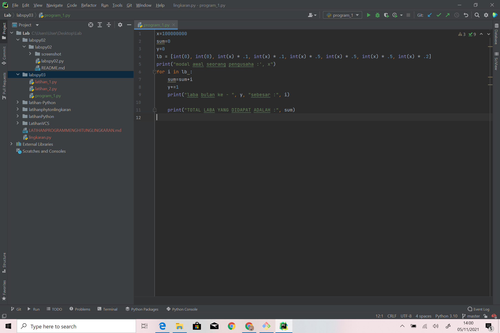
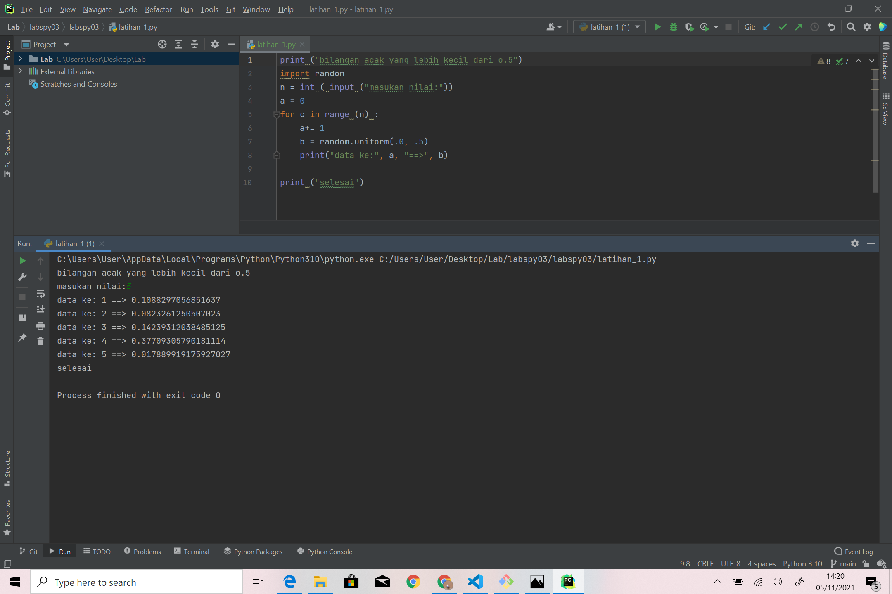
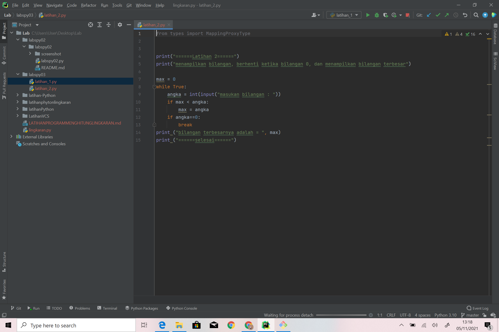
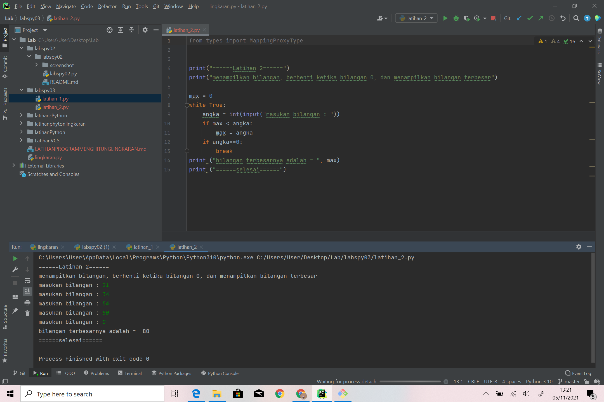
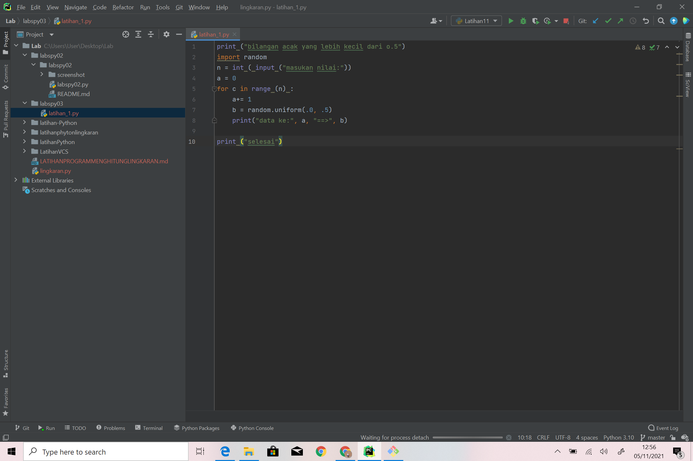
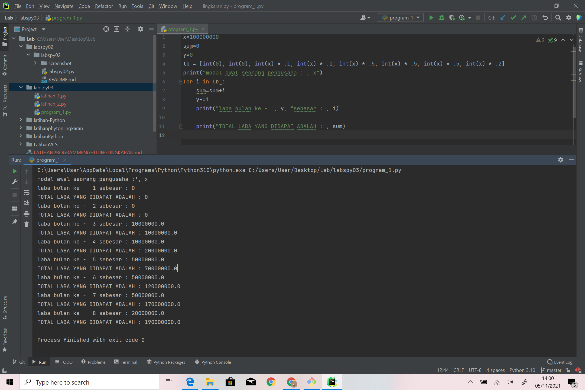

# Labspy02 dan Labspy03
## Labspy02
### Mencari Angka Terbesar Dari 3 Angka
berikut saya tampilkan flowchart dari program mencari angka terbesar

### Persiapan Variabel
kita mulai langsung dengan menyiapkan 3 buah variabel, yaitu a, b, dan c.
Ketiga variabel ini kita isi dari inputan user seperti berikut:

### Mencari Angka Terbesar Antara a, b, dan c
Langkah selanjutnya adalah menulis logika untuk mencari angka terbesar, apakah itu a? b? atau c?
Berikut ini kira-kira implementasi logikanya:

Sekarang coba kita testing, saya coba masukkan angka 2, 3, dan 4:

berikut saya tampilkan screenshot seluruh layar dari program

### sekian dan terima kasih ;)

## labpy03
### latihan 1 :
#### Algoritma latihan1 :

Menampilkan n bilangan acak yang lebih kecil dari 0,5, nilai n diisi 
pada saat runtime.

1.Memasukan/ import fungsi RANDOM terlebih dahulu

2.Deklarasi integer , masukkan jumlah n :

3.Memasukan deskripsi kombinasi for untuk menyelesaikannya.

4.Memasukan nilai jumlah (n) : 5

5.Mencetak data ke 1 sampai 5 dengan hasil nilai kurang dari 0,5.

6.Selesai

#### Syntax latihan 1 sebagai berikut :

#### Hasil out put latihan 1 sebagai berikut :

### latihan 2 :
#### Algoritma latihan 2:

Membuat program untuk menampilkan bilangan terbesar dari n buah data 
yang diinputkan.Masukkan angka 0 untuk berhenti

1.Mulai

2.Mencetak "latihan 2"

3.Mencetak "menampilkan bilangan, berhenti ketika bilangan 0, 
menampilkan bilangan terbesar"

4.integer max = 0 

5.Menggunakan fungsi perulangan while true, hingga menampilkan 
perulangan sampai batas tertentu. 

6.Memasukan bilangan integer pada "a"

7.Menggunakan fungsi if jika max kurang dari nilai a, maka max sama 
dengan a 

8.Mengunakan fungsi if jika nilai a adalah 0 maka fungsi break artinya 
perulangan berhenti jika menulis nilai 0.

9.Mencetak nilai paling terbesarv setelah break, sehingga menampilkan 
nilai terbesar diantara bilangan tersebut dalam perulangan.

10.Selesai

#### Syntax latihan 2 sebagai berikut :

#### Hasil out put latihan 2 ketika di runtime sebagai berikut :

### program 1 :

#### ALGORITMA menghitung keuntungan selama 8 bulan berjalannya usaha.

1.Mulai

2.Mencetak latihan1

3.Mencetak "Program menghitung laba dengan modal awal 100 juta"

4.Membuat Note 

5.Mencetak Bulan pertama dan kedua = 0%

6.Mencetak bulan ke 3 = 1%

7.Mencetak bulan ke 5 = 5%

8.Mencetak bulan ke 8 = 2%

9.integer a = 100.000.000( modal awal)

10.Menggunakan fungsi looping for pada nilai x 1-9 untuk menampilkan 
bulan 1 sampai 
bulan 8.

11.Menggunakan fungsi if, untuk menghitung laba bulan 1 sampai 8

12.bulan pertama dan kedua laba adalah 0

13.bulan ke 3 dan ke 4 mendapat laba 1% sehingga modal di kali 1% = 
keuntungan

14.bulan ke 5 mendapatkan laba 5%, sehingga modal dikali 5% = keuntungan 

15.Bulan ke 8 mmendapatkan laba 2% sehingga keuntungan menurun dari 
bulan sebelumnya, 
modal dikali 2% = keuntungan.

16.Menghitung jumlah total laba dengan menjumlah keuntungan dari bulan 
ke 1 sampai 
bulan 8, hasilnya adalah total keuntungan yang didapat.

17.Selesai

#### Syntax program1 sebagai berikut :

#### Hasil out put program1 ketika runtime adalah sebagai berikut :

#### sekian dan terima kasih :)